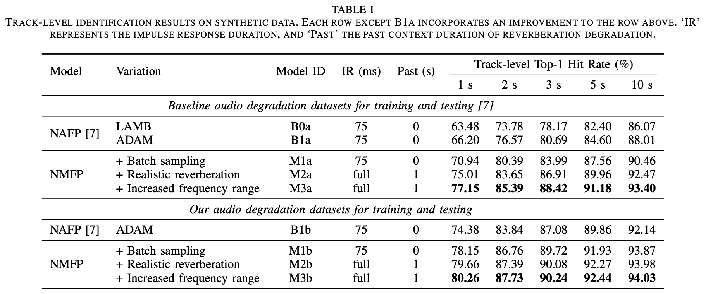

# Neural Music Fingerprinting

This repository contains the code to run the experiments described in our paper 'Enhancing Neural Audio Fingerprint Robustness to Audio Degradation for Music Identification' submitted to ICASSP2025. Our work builds upon [Neural Audio Fingerprinting (NAFP)](https://github.com/mimbres/neural-audio-fp), introducing various improvements. In addition to these enhancements, we updated several packages:

* python 3.11
* tensorflow 2.13
* faiss 1.7.2

Check the sections of this README for detailed instructions, or refer to the `pipeline.sh` file for a complete workflow overview.

## Table of Content

- [Installation](#installation)
    - [GPU support](#gpu-support)
    - [CPU only](#cpu-only)
- [Dataset](#dataset)
    - [Re-create the Dataset](#re-create-the-dataset)
    - [Download the Dataset](#download-the-dataset)
- [Download Pre-trained Fingerprinters](#download-pre-trained-fingerprinters)
- [Train a model](#train-a-fingerprinter)
- [Create fingerprints](#create-fingerprints)
- [Perform Retrieval and Evaluate](#perform-retrieval-and-evaluate)

## Installation

### GPU support

1. Create the environment:

    ```bash
    conda create -n nmfp python=3.11
    conda activate nmfp
    ```

1. Install CUDA dependencies for TensorFlow 2.13:

    ```bash
    conda install -c conda-forge cudatoolkit=11.8 cudnn=8.8
    mkdir -p $CONDA_PREFIX/etc/conda/activate.d
    echo 'export LD_LIBRARY_PATH=$LD_LIBRARY_PATH:$CONDA_PREFIX/lib/' > $CONDA_PREFIX/etc/conda/activate.d/env_vars.sh
    ```

    **Note**: You might need to log off or reboot your session to apply the changes.

1. Install faiss and other dependencies:

    ```bash
    conda activate nmfp
    conda install -c conda-forge faiss-gpu=1.7.2
    conda install pyyaml scipy=1.11.4 pandas=2.1.4 matplotlib=3.8
    ```

1. Install TensorFlow:

    ```bash
    pip install tensorflow==2.13
    ```

    Verify installation:

    ```bash
    python -c "import os; os.environ['TF_CPP_MIN_LOG_LEVEL'] = '3'; import tensorflow as tf; print('Num GPUs Available: ', len(tf.config.list_physical_devices('GPU')))"
    ```

1. Install essentia:

    ```bash
    pip install essentia==2.1b6.dev1110
    ```

#### `Error: Can't find libdevice directory ${CUDA_DIR}/nvvm/libdevice`

If you get this [error](https://github.com/tensorflow/tensorflow/issues/58681), you need to follow these steps.

```bash
conda install -c nvidia cuda-nvcc --yes
mkdir -p $CONDA_PREFIX/lib/nvvm/libdevice/
cp -p $CONDA_PREFIX/lib/libdevice.10.bc $CONDA_PREFIX/lib/nvvm/libdevice/
export XLA_FLAGS=--xla_gpu_cuda_data_dir=$CONDA_PREFIX/lib
```

### CPU only

1. Create the environment:

    ```bash
    conda create -n nmfp python=3.11
    conda activate nmfp
    ```

1. Add LD_LIBRARY_PATH to the path:

    ```bash
    mkdir -p $CONDA_PREFIX/etc/conda/activate.d
    echo 'export LD_LIBRARY_PATH=$LD_LIBRARY_PATH:$CONDA_PREFIX/lib/' > $CONDA_PREFIX/etc/conda/activate.d/env_vars.sh
    ```

    **Note**: You need to log off and log in again.

1. Install dependencies:

    ```bash
    conda activate nmfp
    conda install -c conda-forge faiss-cpu=1.7.2
    conda install pyyaml scipy=1.11.4 pandas=2.1.4 matplotlib=3.8
    pip install tensorflow-cpu==2.13
    pip install essentia==2.1b6.dev1110
    ```

## Dataset

For music, we use the [FMA dataset](https://github.com/mdeff/fma), for audio degradation we use multiple publicly available datasets. For downloading the processed data that were used in our experiments or reading the instructions on how we created the data, follow read the reminder of this section.

### Re-create the Dataset

This [README](./dataset_creation/README.md) file contains the steps to reproduce the dataset. The same folder contains *all* the code to process and split data. This [notebook](./dataset_creation/degradation_analysis_and_split.ipynb) analyzes NAFP's and ours audio degradation files in detail and creates the splits.

### Download the Dataset

Soon we will host the processed data on Zenodo! Until then, please refer to: [README](./dataset_creation/README.md).

## Download Pre-trained Fingerprinters

You can find the pre-trained fingerprinters described in the paper in our [drive folder](https://drive.google.com/drive/folders/1ZbZyA8KpX89GruKeDiFsseXTJBZw_Rfq?usp=sharing).
TODO: add the models to Essentia.



*NOTE*: To run B0a, B1a, and B1b models you need to use the original [NAFP repository](https://github.com/mimbres/neural-audio-fp). We provide the B1a and B1b models that we trained, however, to download B0a (trained by the NAFP authors) you should also refer to their repository.

## Train a Fingerprinter

We use YAML config files to define the architecture, model, data, and training parameters. Below is an example of how to train a model using the config file `config/default_nmfp.yaml`. Training logs and model checkpoints will be saved to the directory specified in the config (`cfg['MODEL']['LOG_ROOT_DIR']`). The trained model's configuration will be saved next to the weights.

Example usage:

```bash
(nmfp) CUDA_VISIBLE_DEVICES=0 python train.py config/default_nmfp.yaml
```

For more information:

```bash
(nmfp) [oaraz@hpcmtg1 nafp_pp]$ python train.py -h

usage: train.py [-h] [--max_epoch MAX_EPOCH] [--cpu_n_workers CPU_N_WORKERS] [--cpu_max_que CPU_MAX_QUE] [--deterministic] [--reduce_tracks REDUCE_TRACKS] config_path

Train a neural audio fingerprinter.

positional arguments:
  config_path           Path to the model and training configuation file.

options:
  -h, --help            show this help message and exit
  --max_epoch MAX_EPOCH
                        Maximum epochs to train. By default uses the value in the config file. Can be used to continue training. If provided it will override the config file. (default: None)
  --cpu_n_workers CPU_N_WORKERS
                        Number of workers for data loading. (default: 10)
  --cpu_max_que CPU_MAX_QUE
                        Max queue size for data loading. (default: 20)
  --deterministic       Set the CUDA operations to be deterministic for the price of slow computations. (default: False)
  --reduce_tracks REDUCE_TRACKS
                        Reduce training tracks size to this percentage. 100 uses all the tracks. (default: 100)
```

## Create Fingerprints

Once you have a trained fingerprinter, you can use it to generate fingerprints. This step is separated from retrieval, therefore you need to specify if the input audio is for creating a database or for querying against an existing database. This script will create a single memmap file for the whole database and individual `.npy` files for the query tracks' fingerprints. You must provide at least the query audio or the database audio to the script.

**Note**: Updating the database requires re-creating it, as incremental updates are not supported.

Example usage:

```bash
(nmfp) CUDA_VISIBLE_DEVICES=0 python generate.py logs/nmfp/fma-nmfp_deg/checkpoint/160Hz/config.yaml --query_chunks ../datasets/neural_music_fingerprinting-dataset/music/test/query/clean-time_shifted-augmented
```

For more information:

```bash
(nmfp) [oaraz@hpcmtg1 nafp_pp]$ python generate.py -h

usage: generate.py [-h] [--query_chunks QUERY_CHUNKS] [--db_tracks DB_TRACKS] [--checkpoint_dir CHECKPOINT_DIR] [--checkpoint_index CHECKPOINT_INDEX] [--output_root_dir OUTPUT_ROOT_DIR] [--output_dir OUTPUT_DIR] [--batch_sz BATCH_SZ]
                   [--hop_duration HOP_DURATION] [--mixed_precision] [--cpu_n_workers CPU_N_WORKERS] [--cpu_max_que CPU_MAX_QUE]
                   config_path

Generate fingerprints from a trained model.

positional arguments:
  config_path           Path to the config file of the model.

options:
  -h, --help            show this help message and exit
  --query_chunks QUERY_CHUNKS
                        Directory containing the query chunks or a line delimited text file containing paths. (default: None)
  --db_tracks DB_TRACKS
                        Directory containing the database tracks or a line delimited text file containing paths. (default: None)
  --checkpoint_dir CHECKPOINT_DIR
                        Directory containing the checkpoints. If not provided, it will first check the config file for a path. If not found, it will look next to the config file. (default: None)
  --checkpoint_index CHECKPOINT_INDEX
                        Checkpoint index. 0 means the latest checkpoint. (default: 0)
  --output_root_dir OUTPUT_ROOT_DIR
                        Root directory where the generated fingerprints will be stored.If not specified, it will be saved in the log directory of the model in the config. Following the structure: log_root_dir/fp/model_name/checkpoint_index/
                        (default: None)
  --output_dir OUTPUT_DIR
                        Output directory where the fingerprints will be stored.If not specified, it will be saved in the output_root_dir. If provided output_root_dir will be ignored. (default: None)
  --batch_sz BATCH_SZ   Batch size for inference. (default: 256)
  --hop_duration HOP_DURATION
                        Fingerprint generation rate in seconds. (default: 0.5)
  --mixed_precision     Use mixed precision during inference. The fingerprints will be saved in FP32 in both cases. (default: False)
  --cpu_n_workers CPU_N_WORKERS
                        Number of workers for data loading. (default: 10)
  --cpu_max_que CPU_MAX_QUE
                        Max queue size for data loading. (default: 10)
```

## Perform Retrieval and Evaluate

After the fingerprints are extracted you can perform retrieval with the fingerprints the retrieval results will be saved to `analysis.csv`.

Example usage:

```bash
CUDA_VISIBLE_DEVICES=0 python evaluate.py logs/nmfp/fma-nmfp_deg/fp/160Hz/100/query/ logs/nmfp/fma-nmfp_deg/fp/160Hz/100/database/
```

For more information:

```bash
(tf) [oaraz@hpcmtg1 nafp_pp]$ CUDA_VISIBLE_DEVICES=0 python evaluate.py -h
usage: evaluate.py [-h] [--output_root_dir OUTPUT_ROOT_DIR] [--output_dir OUTPUT_DIR] [--index_type INDEX_TYPE] [--max_train MAX_TRAIN] [--n_probe N_PROBE] [--top_k TOP_K] [--segment_duration SEGMENT_DURATION] [--hop_duration HOP_DURATION]
                   [--test_seq_len TEST_SEQ_LEN] [--delta_n DELTA_N] [--display_interval DISPLAY_INTERVAL] [--no_gpu]
                   query_dir database_dir

Segment/sequence-wise music search and evaluation: implementation based on FAISS.

positional arguments:
  query_dir             Path to the query directory.
  database_dir          Path to the database directory.

options:
  -h, --help            show this help message and exit
  --output_root_dir OUTPUT_ROOT_DIR
                        Output root directory. Inside the root directory, the results will be saved in output_root_dir/<model_name>/<checkpoint_index>/. By default it sets the root directory to 3 levels above the fingerprints_dir. (default:
                        None)
  --output_dir OUTPUT_DIR
                        Output directory. If not provided, it will be created inside the output_root_dir. (default: None)
  --index_type INDEX_TYPE, -i INDEX_TYPE
                        Index type must be one of {'L2', 'IVF', 'IVFPQ', 'IVFPQ-RR', 'IVFPQ-ONDISK', HNSW'} (default: ivfpq)
  --max_train MAX_TRAIN
                        Max number of items for index training. Default is all the data. (default: None)
  --n_probe N_PROBE     Number of neighboring cells to visit during search. Default is 40. (default: 40)
  --top_k TOP_K, -k TOP_K
                        Top k search for each segment. Default is 20 (default: 20)
  --segment_duration SEGMENT_DURATION
                        Fingerprint context duration in seconds. Default is 1.0 seconds. Only used for display purposes. (default: 1.0)
  --hop_duration HOP_DURATION
                        Fingerprint generation rate in seconds. Default is 0.5 seconds.Only used for display purposes. (default: 0.5)
  --test_seq_len TEST_SEQ_LEN
                        Comma-separated sequence lengths to test. Default is '1,3,5,9,19', corresponding to sequence durations of 1s, 2s, 3s, 5s, and 10s with a 1s segment and 0.5s hop duration. (default: 1,3,5,9,19)
  --delta_n DELTA_N     Number of segments difference per query sequence. With hop_dur 0.5 seconds, corresponds to 3.5 seconds. (default: 7)
  --display_interval DISPLAY_INTERVAL, -dp DISPLAY_INTERVAL
                        Display interval. Default is 100, which updates the table every 100 query sequences. (default: 100)
  --no_gpu              Use this flag to use CPU only. (default: False)
(tf) [oaraz@hpcmtg1 nafp_pp]$
```

Example from the `anaysis.csv` file:

```csv
query_track_path,query_start_segment,query_chunk_bound,seq_start_idx,seq_len,gt_track_path,pred_track_path,pred_start_segment,score
../datasets/neural_music_fingerprinting-dataset/music/test/query/clean-time_shifted-degraded/000/000046.wav,76,76,0,1,../datasets/neural_music_fingerprinting-dataset/music/test/database/000/000046.wav,../datasets/neural_music_fingerprinting-dataset/music/test/database/000/000046.wav,76,0.8453805446624756
../datasets/neural_music_fingerprinting-dataset/music/test/query/clean-time_shifted-degraded/000/000046.wav,76,76,0,3,../datasets/neural_music_fingerprinting-dataset/music/test/database/000/000046.wav,../datasets/neural_music_fingerprinting-dataset/music/test/database/000/000046.wav,76,0.8185903429985046
```

The script will evaluate the retrieval performance with the following metrics: 

* track-level
    * Top-1 Hit rate
* segment-level
    * Exact Top-1 Hit rate (aligned)
    * Near Top-1 Hit rate (< 500 ms misalignment)
    * Far Top-1 Hit rate (> 500 ms misalignment)

Metrics will be saved as `track_hit_rate.txt` and `segment_hit_rate.txt`.
